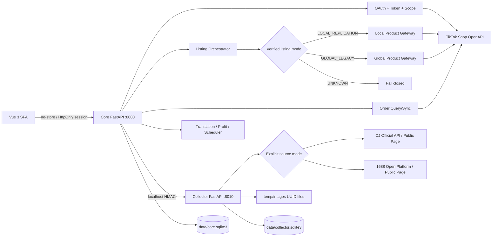

# TikTok 单店管理系统全量开发计划

## 已确认基线与边界

- 当前仓库只有 [`接口审查.txt`](H:/tiktok/接口审查.txt)，没有现有代码或已上传的 OpenAPI Schema；该文件已确认核心商品、订单、OAuth、签名、Scope 与 Local/Global 双链路边界。
- TikTok 端点按能力独立登记版本：创建/详情/价格/库存/上下架为 `202309`，编辑为 `202509`，搜索为 `202502`，订单列表为 `202309`，订单详情为 `202507`；禁止统一版本号。
- `listing_mode=UNKNOWN` 时所有商品写入 fail closed。只通过只读事实自动判定；证据冲突时保持 `UNKNOWN`，不通过试写探测，也不在 Local Replication 与 Global Legacy 间自动切换。
- “无缓存”解释为：不使用 Redis、进程内结果缓存、文件缓存、浏览器持久缓存、Service Worker 或 HTTP 响应缓存。OAuth state、幂等记录、草稿、调度任务、同步游标和审计日志是业务事实，允许事务性写入 SQLite，否则相关功能无法正确实现。
- 运行时代码只允许写项目内 `.env`/配置、`data/*.sqlite3` 和 `temp/images/<uuid>.<ext>`；源码、依赖与前端构建属于开发/构建产物，不开放给业务接口读写。
- 不生成 Docker 配置，不扫描盘符，不获取系统根目录，不执行系统清理/权限命令，不递归删除目录。临时图片只能按数据库记录逐个校验并 `unlink()` 单文件。
- 无真实凭据阶段不提供假业务数据、伪造上游响应或“演示成功”；纯函数测试使用官方签名向量和确定性边界输入，真实集成项明确报告为 `BLOCKED_LIVE_CREDENTIALS`。

## 目标架构

核心 API 与采集服务使用不同入口、不同 SQLite、不同限流域；采集异常不会拖垮 TikTok 主链路。两者仅通过 `127.0.0.1` 内部 HMAC API 通信，采集包禁止导入 TikTok Gateway。

## 实施步骤

### 1. 建立工程骨架与强制安全底座

- 在 [`backend/pyproject.toml`](H:/tiktok/backend/pyproject.toml)、[`frontend/package.json`](H:/tiktok/frontend/package.json) 建立 Python/FastAPI 与 Vue 3/Vite/TypeScript/Element Plus 工程；提供两个 Python 入口 [`backend/app/main.py`](H:/tiktok/backend/app/main.py) 和 [`backend/collector_app/main.py`](H:/tiktok/backend/collector_app/main.py)。
- 在 [`backend/shared/safe_paths.py`](H:/tiktok/backend/shared/safe_paths.py) 集中实现 `Path.resolve()`、项目根包含关系、允许文件类别、UUID 图片名、扩展名/MIME/大小校验；所有文件调用只能依赖该模块。
- 在 [`backend/shared/security.py`](H:/tiktok/backend/shared/security.py) 实现 AES-GCM 字段加密、密钥版本、内部服务 HMAC、常量时间比较；在 [`backend/shared/redaction.py`](H:/tiktok/backend/shared/redaction.py) 统一脱敏 Token、Cookie、签名正文、URL Query 和买家隐私。
- 配置响应 `Cache-Control: no-store`，前端统一 `fetch(..., { cache: 'no-store' })`，禁止 LocalStorage/IndexedDB/Service Worker；数据库使用短生命周期会话，不建立业务对象缓存。

### 2. 建立业务模型、SQLite 迁移与无缓存任务机制

- 在 [`backend/app/domain/`](H:/tiktok/backend/app/domain) 用枚举、不可变值对象和纯函数定义授权状态、Scope 能力、刊登模式、规范化商品、市场状态、写操作状态机与额度策略。
- 在 [`backend/app/db/models.py`](H:/tiktok/backend/app/db/models.py) 与 [`backend/migrations/core/`](H:/tiktok/backend/migrations/core) 建立 `admin_sessions`、`oauth_transactions`、`encrypted_credentials`、`shop_binding`、`scope_snapshots`、`listing_mode_evidence`、`product_drafts`、`product_links`、`market_product_states`、`idempotent_operations`、`quota_snapshots`、`order_sync_checkpoints`、`schedule_jobs`、`schedule_runs`、`audit_logs`、`rate_limit_windows`。
- 在 [`backend/collector_app/db/models.py`](H:/tiktok/backend/collector_app/db/models.py) 建立独立的 `collector_jobs`、`collector_results`、`collector_attempts`、`source_rate_limits` 与图片登记表；采集结果是待导入业务事实，不作为上游响应缓存复用。
- 不使用 Celery/Redis/APScheduler 持久化缓存；两个服务各自运行 SQLite 驱动的轮询执行器，每次事务领取到期任务，进程重启后按数据库状态恢复。
- SQLAlchemy 模型避免 SQLite 私有类型并提供 `DATABASE_URL`，核心库预留 MySQL 方言；迁移与约束在 SQLite 上先落地。

### 3. 实现 TikTok OAuth、签名客户端和单店能力注册表

- 在 [`backend/app/integrations/tiktok/endpoints.py`](H:/tiktok/backend/app/integrations/tiktok/endpoints.py) 建立唯一 Endpoint Registry，逐端点记录 method、path、version、Scope、读写属性、幂等策略与重试策略。
- 在 [`backend/app/integrations/tiktok/signing.py`](H:/tiktok/backend/app/integrations/tiktok/signing.py) 严格实现 Query 排序、排除 `sign/access_token`、最终原始正文参与签名、multipart 不签正文、10 位时间戳与 HMAC-SHA256。
- 在 [`backend/app/integrations/tiktok/client.py`](H:/tiktok/backend/app/integrations/tiktok/client.py) 实现短期 `httpx.AsyncClient` 请求、`x-tts-access-token`、错误分类、`429/36009002`、`Retry-After`、503 分离、指数退避抖动；仅对安全读操作或具备已登记幂等/可对账策略的写操作自动重试。
- 在 [`backend/app/use_cases/authorization.py`](H:/tiktok/backend/app/use_cases/authorization.py) 实现单次短期 state、`grant_type=authorized_code` 换码、自动刷新、Scope 差集阻断、授权店铺获取、单店绑定、去授权停用任务。
- Token、refresh token、`shop_cipher`、货源会话全部 AES-GCM 密文落库；`app_secret`、加密主密钥和翻译密钥只来自环境变量。

### 4. 实现刊登模式探测与商品全生命周期

- 在 [`backend/app/use_cases/listing_mode.py`](H:/tiktok/backend/app/use_cases/listing_mode.py) 汇总授权店铺返回、卖家类型、可用 Scope、只读 Local/Global 查询能力和目标账户确认信息，生成带证据的判定；任何歧义保持 `UNKNOWN`。
- 在 [`backend/app/use_cases/listing.py`](H:/tiktok/backend/app/use_cases/listing.py) 实现单一路由器：Local Replication 只调用 [`local_products.py`](H:/tiktok/backend/app/integrations/tiktok/local_products.py)，Global Legacy 只调用 [`global_products.py`](H:/tiktok/backend/app/integrations/tiktok/global_products.py)，禁止异常兜底切换。
- 完成商品实时搜索/详情、创建、全量/部分编辑、价格、库存、激活、下架、远端单商品删除和 Local Replication 分市场状态；Global 已发布全量编辑设置高风险确认，异常的 Global Partial Edit 202509 默认禁用。
- 写操作以 `shop + operation + business_key + payload_hash` 建立幂等记录；创建类接口若没有平台幂等键，则先按 seller SKU/本地映射对账，无法确认远端结果时停止自动重试并进入人工核对，避免重复商品。
- 类目、属性、仓库、配送选项和图片上传均实时调用，不落缓存。动态类目属性由规范化键值结构表达，提交前用实时属性约束校验。
- MY 新店额度没有可安全逆向的公开实时 API：保存用户从 Seller Center 确认的额度快照和本地已提交计数；快照过期或不足时 fail closed/排队，绝不逆向 TikTok 私有 Seller Center，也不宣称可绕过额度。

### 5. 实现真实 1688/CJ 采集、图片处理与商品映射

- 在 [`backend/collector_app/sources/registry.py`](H:/tiktok/backend/collector_app/sources/registry.py) 定义函数式 `SourceAdapter` 协议与显式来源模式，新增来源只注册 URL 匹配、鉴权需求、抓取、规范化函数。
- CJ 优先在 [`backend/collector_app/sources/cj/official.py`](H:/tiktok/backend/collector_app/sources/cj/official.py) 对接 `developers.cjdropshipping.com/api2.0/v1` 和 `CJ-Access-Token`；1688 优先在 [`backend/collector_app/sources/ali1688/open_platform.py`](H:/tiktok/backend/collector_app/sources/ali1688/open_platform.py) 对接本人授权的开放平台。公开页面模式分别独立实现且必须显式启用，不能在官方接口失败后静默切换。
- 在 [`backend/collector_app/reverse/`](H:/tiktok/backend/collector_app/reverse) 仅实现已观察到的公开页面内嵌 JSON、公开 XHR 参数和来源专属签名纯函数；不执行任意远端 JS，不破解登录、不绕过验证码/风控。若页面必须通过治理校验才能访问，任务直接失败并给出可操作原因。
- 请求层限定 1688/CJ 与登记 CDN 域名，HTTPS only；每次 DNS/重定向均拒绝私网、回环、链路本地和 IP 字面量，限制响应大小、超时、并发、重试和来源频率。随机 UA、Accept-Language 与时间抖动只模拟普通读取节奏，不做高并发或规避封禁。
- 在 [`backend/collector_app/images.py`](H:/tiktok/backend/collector_app/images.py) 以 UUID 自动命名，流式下载到 `temp/images`，拒绝 SVG/伪造 MIME/超限图片；用 Pillow 裁剪、水印。清理时按登记记录逐个 resolve、校验 UUID 后删除单文件，永不删除目录。
- 在 [`backend/app/use_cases/source_import.py`](H:/tiktok/backend/app/use_cases/source_import.py) 将真实采集结果映射为规范化 TikTok 草稿，保留字段来源与未映射告警，必须人工确认类目、属性、价格、库存、图片和目标市场后才允许刊登。

### 6. 实现订单、翻译、利润、定时铺货、日志和 Webhook

- 在 [`backend/app/use_cases/orders.py`](H:/tiktok/backend/app/use_cases/orders.py) 实现订单列表实时分页、202507 详情批量 50 条、增量时间窗和同步游标；不保存完整订单响应或买家 PII，只保存游标、运行摘要和脱敏审计事实。
- 在 [`backend/app/integrations/translation/`](H:/tiktok/backend/app/integrations/translation) 建立 Provider 接口并先接 Azure Translator 的中/英/马来语真实 API；无 Key 时返回明确配置阻塞，不生成伪翻译，不做翻译缓存。
- 在 [`backend/app/use_cases/profit.py`](H:/tiktok/backend/app/use_cases/profit.py) 以 Decimal 纯函数计算汇率、佣金、利润率、建议售价和预估利润，明确舍入策略与币种。
- 在 [`backend/app/use_cases/scheduler.py`](H:/tiktok/backend/app/use_cases/scheduler.py) 实现 SQLite 到期任务领取、启停、间隔/定时规则、Scope/Token/模式/额度前置检查和运行日志；去授权后事务性停用相关任务。
- 在 [`backend/app/api/routes/webhooks.py`](H:/tiktok/backend/app/api/routes/webhooks.py) 预留并实现已确认签名规范的授权取消、商品/订单状态事件；未知事件只做脱敏登记，验签失败不改变状态。

### 7. 完成 Vue 3 后台界面与后端 API

- 在 [`frontend/src/router/index.ts`](H:/tiktok/frontend/src/router/index.ts) 和 [`frontend/src/layouts/AdminLayout.vue`](H:/tiktok/frontend/src/layouts/AdminLayout.vue) 建立单店后台导航、权限缺口提示、店铺/模式/Token 健康状态和全局错误处理。
- 实现授权与店铺、商品列表/详情/编辑/草稿/跨市场状态、货源采集与字段修正、订单、翻译/利润、定时任务、操作日志页面；无凭据和空数据均展示真实空状态，不注入演示记录。
- 前端仅调用 Core API；不接触 TikTok/CJ/1688/翻译密钥，不直连 Collector。业务数据不持久化到浏览器，切页和刷新均重新请求。
- 后端路由按 [`backend/app/api/routes/`](H:/tiktok/backend/app/api/routes) 分模块，Pydantic 请求模型拒绝多余敏感字段；写操作统一要求幂等键、CSRF 防护、权限与模式守卫。

### 8. 验证、Windows 交付文档与风险清单

- 在 [`backend/tests/`](H:/tiktok/backend/tests) 覆盖路径穿越、符号链接/重解析点逃逸、UUID 图片名、单文件删除、加密/脱敏、官方签名向量、Scope 差集、模式 fail closed、端点版本、重试/幂等状态机、额度和利润纯函数；不使用伪造 TikTok/货源响应。
- 在 [`backend/live_tests/`](H:/tiktok/backend/live_tests) 建立显式真实联调命令：OAuth/刷新/去授权、店铺模式、商品创建到删除、订单读、CJ/1688 真 URL、图片上传、翻译。凭据缺失时生成阻塞报告，不把测试计为通过。
- 在 [`frontend/tests/`](H:/tiktok/frontend/tests) 验证无数据、配置缺失和真实后端联通流程；不维护 Mock Server 或假数据夹具。
- 提供 [`.env.example`](H:/tiktok/.env.example)、[`README.md`](H:/tiktok/README.md)、[`docs/windows-setup.md`](H:/tiktok/docs/windows-setup.md)、[`docs/tiktok-custom-app.md`](H:/tiktok/docs/tiktok-custom-app.md)、[`docs/collector-compliance.md`](H:/tiktok/docs/collector-compliance.md)、[`docs/limitations-and-risks.md`](H:/tiktok/docs/limitations-and-risks.md) 与安全 PowerShell 启动脚本；仅写 Windows 本地与后续 Linux 原生部署说明，不出现容器方案或危险清理命令。
- 最终验收分两层：源码/静态/纯函数/空状态可在无 Key 时完成；“真实可运行”必须等明日本机写入 Key、本人店铺授权和真实来源 URL 后完成 live tests。任何未核验端点、Scope、刊登模式或采集链路均保留阻塞状态，不伪报完成。

## 阶段里程碑补充：妙手平台只读店铺查询

- 阶段范围仅为可选的妙手 JCOP 授权店铺列表 Provider，以及受管理员会话保护的 Core API 和前端查询页面；不纳入采集箱编辑、发布或任何店铺写操作。
- Provider 默认关闭，只有 `MIAOSHOU_ENABLED=true` 且环境中的 App Key/App Secret 配置有效时才启用；查询不写 SQLite、不缓存、不伪造空状态。
- 离线契约、错误脱敏、受保护 API 与前端边界已通过自动化验证；具体命令和结果记录在 [`docs/progress-review-2026-08-06.md`](H:/tiktok/docs/progress-review-2026-08-06.md)。
- 真实上游 Shop Query 尚未执行：当前没有显式环境凭据，在线官方文档又受密码保护，故保留 `MIAOSHOU_PROVIDER_DISABLED` / `BLOCKED_LIVE_CREDENTIALS`，不将 transport 测试计作真实联调。
- YAML 中八项 todo 继续保持 `pending`。这些 todo 是全项目范围，本次局部里程碑没有完整满足其中任何一项，不能据此虚报为 `completed`。
