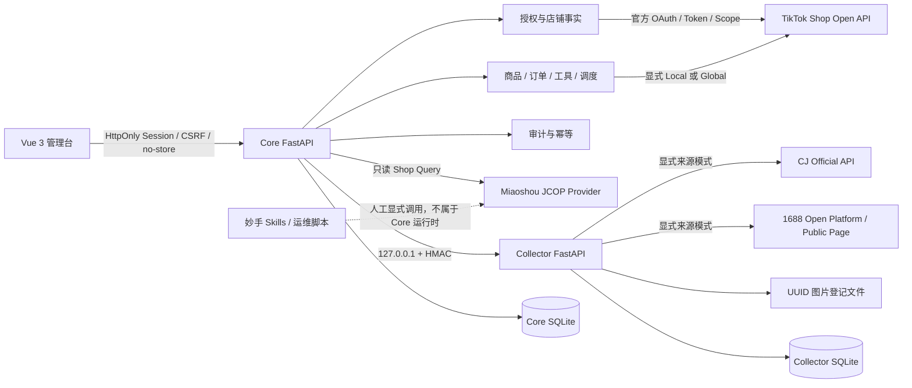

# TikTok 单店管理系统最新版实施与验收计划

> 版本基线：2026-08-07 代码库现状。
> 计划定位：这是当前主路线图，不再以“从空仓库开始”为前提。
> 证据分工：本文件描述目标、阶段和完成定义；[`progress-review-2026-08-06.md`](progress-review-2026-08-06.md) 保存阶段证据；[`remember.md`](remember.md) 只作为当前重构任务的临时外部记忆。

## 1. 状态口径

- `completed`：源码边界已经形成，并有当前仓库中的自动化测试或静态证据支撑。它只表示该工程里程碑完成，不自动等于真实平台验收通过。
- `in_progress`：主链路已经存在，但仍有明确回归缺口、操作面缺失或未完成的验收门槛。
- `pending`：尚未形成完整的 API、状态变更、前端入口和验证闭环。
- 真实凭据、真实店铺和真实来源 URL 的验收单独记录；Mock、受控 transport、纯函数测试和 Skill 文件存在都不能替代真实验收。

## 2. 当前基线

项目已经形成可运行的本地管理系统骨架，而不是原计划中的空仓库：

- `frontend/`：Vue 3、TypeScript、Vite、Element Plus；已有管理员登录、总览、妙手店铺、商品、订单、运营工具、调度和审计页面。
- `backend/app/`：Core FastAPI；负责浏览器会话、店铺事实、TikTok 官方 API、商品与订单用例、翻译利润、调度、审计及妙手只读店铺查询。
- `backend/collector_app/`：独立 Collector FastAPI；负责来源访问、任务租约、规范化、图片登记和导出，不导入 TikTok Gateway。
- `backend/app/db/models.py`：Core 业务模型覆盖 Session、OAuth、加密凭据、店铺、Scope、刊登模式证据、草稿、采集回执、图片资产、商品链接、幂等、额度、订单行、调度、审计和限流。
- `backend/collector_app/db/models.py`：Collector 独立保存采集任务、结果、尝试、来源限流、图片和来源凭据。
- Core Schema 已演进到 v4，Collector Schema 为 v1；两者在启动时执行版本化迁移。
- 最近一次持久化验证记录显示：后端 `152 passed, 1 skipped`，前端 `6 passed`，TypeScript 类型检查与生产构建通过。该结果是既有证据，本轮计划重构没有重新执行测试。

当前尚不能称为“真实店铺全功能可交付”：TikTok OAuth 没有 HTTP/UI 操作闭环，商品生命周期只完成草稿创建与远端读链路的一部分，多项真实 Provider 验收仍被凭据或契约阻塞。

## 3. 目标与非目标

### 3.1 当前目标

1. 先把自动化基线变成可信事实，修复已知回归风险。
2. 将现有 TikTok OAuth 与单店绑定能力接入 Core API 和前端，形成用户可操作闭环。
3. 在同一个商品领域模型上补齐 Local/Global 商品生命周期，不让平台 DTO 扩散到页面和调度层。
4. 保持 TikTok 官方 API 为店铺事实与刊登的主链路；Collector 和妙手只通过明确 Provider 边界提供能力。
5. 对真实联调建立可复现、可脱敏、可审计的验收记录，而不是依赖一次性终端输出。
6. 交付 Windows 原生启动、配置、风险和故障排查文档。

### 3.2 明确非目标

- 不引入 Docker、Redis、Celery 或业务结果缓存。
- 不把妙手隐式替换为 TikTok 官方 API，也不在官方链路失败时自动降级到妙手。
- 不破解登录、验证码或风控，不逆向私有 Seller Center 接口。
- 不以 Mock 平台响应证明真实刊登、真实订单、真实翻译或真实采集通过。
- 不自动执行妙手认领、编辑、发布、删除等写操作；在专门里程碑完成前继续 fail closed。
- 不扩展为多租户 SaaS；当前仍以本人单店、单管理员、本机运行为边界。

## 4. 现行架构

### 4.1 模块职责

- **前端**：只持有当前页面内存状态；调用 Core API；不读取 TikTok、CJ、1688、Azure 或妙手密钥；不直连 Collector。
- **Core API**：认证管理员、执行 CSRF/幂等/Scope/刊登模式/额度守卫，编排领域用例并保存业务事实。
- **TikTok 集成层**：管理官方签名、端点版本、重试与错误分类；不得承载页面状态或数据库事务。
- **Collector**：访问受控来源、规范化商品和图片并输出版本化 envelope；不能读取 Core SQLite。
- **妙手 Provider**：当前运行时只提供授权店铺只读查询；未来能力必须通过独立端口接入，不能把妙手响应 DTO 直接写入 TikTok 领域模型。
- **妙手 Skills**：属于人工辅助操作资产。Skill 可独立运行不代表 Core 产品已经拥有对应能力。
- **SQLite**：只保存 Session、授权、幂等、草稿、任务、审计等业务事实；不作为上游响应缓存。

### 4.2 关键数据流

#### TikTok 商品提交

1. 管理员选择已授权且可写的店铺。
2. Core 根据持久化证据判定 `LOCAL_REPLICATION` 或 `GLOBAL_LEGACY`；`UNKNOWN` 立即阻断。
3. 草稿经过人工确认、实时能力校验和额度快照检查。
4. Core 以业务键和 Payload Hash 登记幂等操作。
5. 创建结果明确时写入商品链接；结果歧义时进入对账，不盲目重试。

#### Collector 导入

1. Core 创建带显式 `source + source_mode` 的采集任务。
2. Collector 通过注册表选择唯一 Adapter；官方模式失败不会静默切换公共页面。
3. 规范化结果和图片记录写入 Collector SQLite。
4. Core 通过 HMAC API 读取版本化 envelope 和图片，幂等生成待确认草稿。
5. 用户确认类目、属性、价格、库存和图片后，才可进入 TikTok 提交流程。

#### 妙手能力

1. Core 当前只允许只读 Shop Query。
2. 其余妙手能力必须先选择是否产品化，再设计专用端口、规范化 DTO、幂等和审计。
3. 所有妙手写入都要求显式 Provider、预览、管理员确认、CSRF、幂等键和稳定结果对账；禁止自动兜底。

## 5. 不可破坏的安全不变量

- 两个 FastAPI 服务默认仅允许回环访问；Core→Collector 还必须验证方法、路径、时间戳和正文 HMAC。
- 所有浏览器响应使用 `Cache-Control: no-store`；前端禁止 LocalStorage、IndexedDB 和 Service Worker。
- Token、Refresh Token、Shop Cipher 和来源凭据以 AES-GCM 密文保存；主密钥和所有 App Secret 只来自环境变量。
- `.env`、SQLite、图片、日志和含明文凭据的本地材料不得进入 Git。
- 出站请求执行 HTTPS、域名、DNS、重定向、私网地址、响应大小和超时限制。
- 所有浏览器触发的 Core 业务写操作必须经过管理员写会话、CSRF、幂等和领域守卫；刊登还必须通过 Scope、模式和额度检查。Collector 内部写入使用独立 HMAC 边界。
- 平台返回不明确时保存“待对账”事实，不把超时推断为成功，也不自动重复创建商品。
- API 错误、审计和验收产物不得包含 Secret、签名、Token、Cookie、完整买家隐私或未脱敏原始响应。

## 6. 已交付能力

以下能力已有源码和自动化证据，可作为后续演进基础：

- 双 FastAPI 服务、双 SQLite、版本化迁移和 SQLite worker 租约机制。
- 管理员 HttpOnly Session、CSRF、no-store、显式 CORS/Host/Loopback 限制。
- AES-GCM KeyRing、内部 HMAC、安全路径、图片 MIME/大小/UUID 校验和统一脱敏。
- TikTok 请求签名、端点独立版本注册、Scope、重试与幂等策略分类。
- 刊登模式证据持久化、人工确认幂等及 `UNKNOWN` 写入阻断。
- 商品草稿、人工确认、额度快照、创建前对账、创建歧义状态和远端商品搜索/详情。
- 订单远端分页、批量详情、同步游标、订单摘要和订单行持久化/读取。
- Collector 任务、CJ 官方适配、1688 Open Platform、显式 1688 公共页、JSON-LD 规范化、安全图片和 HMAC 导入回执。
- Azure Translator Provider、Decimal 利润计算、SQLite 调度、审计列表和 Webhook 失败关闭边界。
- Vue 管理台的店铺选择、能力提示、商品草稿、订单、工具、调度和审计操作面。
- 妙手 Shop Query 的签名客户端、错误脱敏、Core 只读 API 和前端页面。
- 妙手 Source Import、公共采集箱、认领、类目推荐、产品编辑和发布的独立 Skills/脚本资产。

## 7. 当前能力与真实验收状态

### 7.1 已实现且离线验证通过

- 安全底座、数据库迁移和内部 HMAC 边界。
- TikTok 签名/端点/错误/重试纯函数与受控 transport 测试。
- 商品草稿创建、额度、幂等、对账和模式阻断。
- 订单同步与订单行持久化的正常详情场景。
- Collector 从任务到 Core 草稿的本地跨进程边界。
- 翻译 Provider 纯边界、利润、调度和审计。
- 妙手 Shop Query 的配置关闭、签名、响应规范化、受保护路由和前端 API。

### 7.2 已实现但仍需真实验收

- TikTok 官方 OAuth、Token 刷新、授权店铺与 Local/Global 只读事实。
- TikTok 商品创建、搜索、详情和订单读取。
- CJ 官方 API、1688 Open Platform、真实 1688 公共页面契约和图片下载。
- Azure Translator 成功链路。
- 妙手 Shop Query：曾有一次 MY 店铺查询成功的会话报告，但当前没有可复核的脱敏持久产物；必须重新执行只读验收后才能标记通过。

### 7.3 尚未产品化的妙手资产

- **Shop Query**：已进入 Core 运行时，允许只读。
- **Source Import**：仅 Skill/脚本；Core 未集成。
- **Common Collect Box Manage**：仅 Skill/脚本；CRUD 写操作未进入 Core。
- **Product Claim**：仅 Skill/脚本；认领写操作未进入 Core。
- **TikTok Category Recommend**：仅 Skill/脚本；推荐结果未进入草稿字段来源模型。
- **TikTok Product Edit**：仅 Skill/脚本；编辑/校验未进入 Core。
- **TikTok Product Publish**：仅 Skill/脚本；发布写操作未进入 Core，保持禁用。

## 8. 当前缺口与技术债

### 8.1 P0 回归风险

**已关闭（P0-A，2026-08-07）**

1. Session 检查生命周期已从路由模块级一次性标志迁入 Session 状态；登出、过期和重新登录会重新触发检查。
2. Session 专项测试已覆盖登出清理、401/expire 清理、readonly 不可写和重新登录检查。
3. Collector 图片路由已有直接无签名请求返回 `401` 的回归测试。

**仍待关闭**

1. 上游订单详情缺少 `line_items/items` 时会被规范化为空列表；当前详情写入可能删除已有订单行。需要区分“字段缺失”和“明确空列表”。
2. 翻译缺少 Provider 成功后的 HTTP 端到端测试，`ToolsView.vue` 缺少交互测试。
3. `.env.example` 当前只包含妙手变量，无法指导完整 Core/Collector/TikTok/Azure 配置。

### 8.2 功能缺口

- TikTok OAuth 用例尚未暴露为管理员可操作的开始授权、回调、选店、刷新和去授权 API/UI。
- 商品编辑、价格、库存、上下架和删除没有完整 Core API + 前端闭环；图片上传端点仍因官方契约证据不足而禁用。
- 前端没有采集任务创建、状态查看、结果预览和导入修正页面。
- Webhook 签名契约未验证，状态变更按设计禁用。
- 没有统一的真实联调 runner 和脱敏验收产物格式。

### 8.3 架构与交付技术债

- Core→Collector 基址仍固定为 `http://127.0.0.1:8010`；后续只能允许安全的 loopback 配置，不能开放任意 URL。
- `ShopBinding.region` 需要在领域/请求边界统一校验 ISO alpha-2，并评估数据库 Check Constraint。
- 需要确认进程异常后的图片 `.part` 文件回收机制。
- 前端主包存在超过 500 kB 的构建警告，应按路由和重依赖拆包，但不能牺牲错误边界。
- 缺少 `README.md`、Windows 安装、TikTok 自定义应用、采集合规、限制与风险文档。
- 当前含明文妙手凭据的本地文档已被 Git 忽略；如曾外传或进入历史，必须轮换 Secret。

## 9. 分阶段 Roadmap

每完成一个 Checkpoint，都必须同步更新 [`progress-review-2026-08-06.md`](progress-review-2026-08-06.md)，记录文件、命令、结果、阻塞和下一步；不能只修改计划状态。

### P0：可信基线与回归封口（当前阶段）

**范围**

- 移除路由模块级 Session 一次性标志，改为由 Session 状态决定检查时机。
- 补齐 Session 四个专项回归场景。
- 增加 Collector 图片路由无签名 `401` 测试。
- 将订单详情解析改为显式表达 `lines_present`；字段缺失时保留已有行，明确空列表时才清空。
- 增加翻译成功 HTTP E2E 和 `ToolsView` 交互测试。
- 重建完整 `.env.example`，只使用空占位符与公开默认值。
- 建立脱敏 live-check 产物格式：时间、目标能力、非敏感输入摘要、状态、脱敏资源标识、失败类别。

**Checkpoint P0-A：Session 与边界测试**

**状态：已完成（2026-08-07）。** 专项与目标边界回归已通过；后端完整回归仍归入 P0 总完成门槛。

- 前端 Session 测试通过。
- Collector 图片直接无签名请求稳定返回 `401`。
- 前端全量测试、类型检查及 Collector HTTP 边界测试无回归。

**Checkpoint P0-B：订单与工具一致性**

- 不完整订单详情不再清空已有行。
- 明确空行详情仍可清空已存行。
- 翻译 HTTP E2E 和 ToolsView 成功/失败交互均有测试。

**Checkpoint P0-C：配置与证据基线**

- `.env.example` 覆盖所有必要变量且不含真实值。
- 妙手只读 Shop Query 重新生成可复核的脱敏验收记录，或明确记录可操作阻塞。

**完成门槛**

- Ruff、后端完整 pytest、前端 typecheck/test/build 全部通过。
- 无敏感信息进入 Git Diff、测试输出和进度文档。

### P1：TikTok 授权与单店绑定闭环

**范围**

- 新增授权配置能力端点，缺少 `TIKTOK_SERVICE_ID`、App Key、App Secret 或主密钥时 fail closed。
- 暴露开始授权、回调消费一次性 state、授权店铺读取和显式单店选择。
- Token/Refresh Token/Shop Cipher 继续只以 AES-GCM 密文落库。
- 增加刷新前置检查、Scope 差集、去授权和事务性停用调度。
- 前端新增授权状态、缺失 Scope、Token 到期和重新授权页面。

**Checkpoint P1-A：只读授权闭环**

- 管理员可以从 UI 发起授权并绑定本人 MY 店铺。
- 多店返回时必须显式选店，不能默认选择。
- 仅执行授权与只读店铺事实，不进行商品写入。

**Checkpoint P1-B：生命周期闭环**

- 刷新和去授权具有并发/失败回归测试。
- 去授权后写操作和调度立即阻断。

**真实验收门槛**

- 在本人店铺上完成 OAuth、刷新与授权店铺读取；持久验收产物只保存脱敏事实。

### P2：商品全生命周期与前端详情编辑

**范围**

- 按 Local/Global 分别实现并暴露编辑、价格、库存、上下架和删除。
- 为商品详情/编辑建立统一领域命令，禁止页面直接拼 TikTok DTO。
- 验证官方图片上传契约后再启用端点；未验证前继续阻断。
- 高风险 Global 全量编辑与发布必须要求二次确认。
- 所有写操作登记幂等键；创建超时继续走 Seller SKU 对账，禁止盲重试。
- 前端增加商品详情、编辑、市场状态和操作结果对账页面。

**Checkpoint P2-A：只读详情与命令预览**

- Local/Global 详情映射稳定，用户可在提交前查看规范化 Diff。

**Checkpoint P2-B：低风险写操作**

- 价格、库存、上下架逐项通过契约测试、权限测试和真实小范围验收。

**Checkpoint P2-C：创建、编辑与删除**

- 创建歧义、重放、删除和 Global 高风险确认均有可恢复状态机。

**完成门槛**

- `UNKNOWN` 模式、Scope 缺失、额度过期、图片契约未验证时全部 fail closed。
- 真实写入只使用专门验收商品，并包含清理/对账步骤；不得批量试写。

### P3：来源采集与 Provider 编排

**范围**

- 前端增加 Collector 任务创建、状态、规范化结果、图片和字段来源预览。
- 用户必须显式选择 CJ 官方、1688 Open Platform 或 1688 Public Page；不自动切换。
- 将“来源获取”“字段推荐”“采集箱管理”“平台发布”拆为不同端口，避免一个 Provider 同时承担全部职责。
- 对妙手逐项进行产品化决策：优先评估 Source Import 和 Category Recommend；公共采集箱 CRUD、认领、编辑、发布继续保持禁用，直到幂等和对账模型完成。
- 妙手与 Collector 导入都映射为同一个 Core 草稿格式，保留 Provider、字段来源和未映射警告。

**Checkpoint P3-A：Collector UI 闭环**

- 从真实 URL 创建任务、查看结果并生成待确认草稿；失败原因可操作且已脱敏。

**Checkpoint P3-B：妙手只读/建议能力**

- 仅接入不会改变店铺状态的查询或推荐能力，并明确展示 Provider 来源。

**Checkpoint P3-C：妙手写能力评审**

- 每个写能力都必须有独立 ADR/契约、预览、CSRF、幂等、审计和结果对账后才能启用。
- 未满足门槛的 Skill 继续作为人工资产，不进入 Core 导航和自动调度。

### P4：订单、工具、自动化与 Webhook 稳固

**范围**

- 完成订单增量窗口、游标恢复、重复详情和部分响应一致性测试。
- 保持最小化订单持久化，不保存买家完整 PII 或原始响应。
- 完成 Azure 翻译成功链路、语言限制、超时/限流和审计。
- 对调度增加重启恢复、长停机、租约丢失、去授权和歧义写入测试。
- 获取并验证 TikTok Webhook 官方签名、时间窗和重放规则后，再启用事件状态变更。
- 前端按路由拆包并补充关键页面交互测试。

**Checkpoint P4-A：订单与工具**

- 订单同步在重复、缺字段和分页中断后均可恢复。
- 翻译、利润的 HTTP 和 UI 路径可审计且不缓存业务结果。

**Checkpoint P4-B：调度与 Webhook**

- 调度只调用已有领域用例，不复制写入逻辑。
- Webhook 验签失败和未知事件不改变业务状态。

### P5：真实联调、Windows 交付与发布准备

**范围**

- 建立独立 `backend/live_tests/` 或等价的显式 live runner；默认不被普通 pytest 收集。
- 逐项验收 TikTok OAuth/刷新/只读/商品写入/订单、CJ、1688、Azure、妙手只读；妙手写能力只有在 P3 批准后才进入矩阵。
- 每次 live check 输出脱敏报告；凭据缺失统一记为 `BLOCKED_LIVE_CREDENTIALS`，权限不足与契约不符使用独立状态。
- 完成 README、Windows 环境准备、启动/停止、迁移、TikTok 自定义应用、采集合规、风险与故障排查文档。
- 提供安全 PowerShell 启动脚本，但不加入系统清理、提权、递归删除或容器命令。

**Checkpoint P5-A：只读真实验收**

- TikTok 授权店铺、商品/订单读取、妙手店铺、CJ/1688 读取和 Azure 翻译分别有可复现结果或明确阻塞。

**Checkpoint P5-B：受控写入验收**

- TikTok 创建→查询→编辑→上下架→删除在专用验收商品上完成。
- 每一步都可对账，不把 HTTP 成功等同于业务成功。

**Checkpoint P5-C：Windows 交付**

- 新机器仅依据文档即可安装依赖、配置空模板、迁移数据库、启动两个服务和前端，并能安全识别缺凭据状态。

## 10. 最终完成定义

项目只有同时满足以下条件，才能从“工程实现”进入“可交付”：

1. P0 所有回归风险关闭，完整静态检查、测试和构建通过。
2. TikTok OAuth、单店绑定、刷新、去授权形成 API+UI+持久化闭环。
3. Local/Global 所有已启用商品操作都有明确端点契约、领域命令、幂等、审计和真实验收。
4. Collector 真实来源和图片链路可复现，不绕过来源风控，不静默降级。
5. 妙手运行时能力与 Skills 边界清晰；未批准的写能力保持禁用。
6. 订单、翻译、调度和 Webhook 不因部分响应、重启或去授权产生错误状态变更。
7. 所有真实验收都有脱敏持久记录；Mock 结果不会被标记为真实通过。
8. Windows 文档、环境模板、风险清单和安全启动流程完整。
9. Git 中不存在真实 Secret、Token、数据库、图片、日志或本地凭据材料。

## 11. 最近下一步

立即执行 **P0-B：订单与工具一致性**。先修复“不完整订单详情误清空已有订单行”的数据语义，再补翻译成功 HTTP E2E 与 `ToolsView` 成功/失败交互；继续只运行使用仓库虚拟环境和临时目录的安全窄测。
